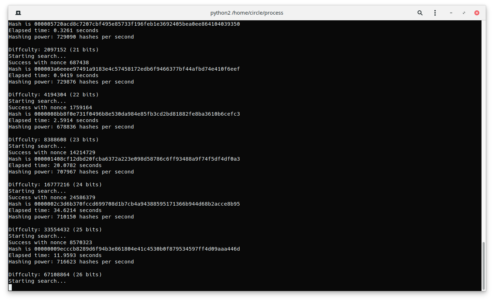

# BTC（对于区块链的应用）    
## 什么是BTC：    
* 一种点对点的电子现金系统。系统的数据是具有货币功能的一种虚拟商品，可以通过挖矿获得（POW比拼算力）。    
* 特点：    
分布式账本，去中心化安全性高。    
总量只有2100W个，产量固定，不会通货膨胀。    
## BTC的组成：    
* 组成部分：私钥K（32字节），公钥P（64字节），地址(20字节）    
此过程是单向的    
    

    
* 如何生成    
1. 私钥K：随机生成的256位二进制数    
2. 公钥P：在私钥的基础上通过ECDSA椭圆曲线签名算法（一种Trapdoor function函数无法逆推）生成。可以简单理解为P=K×G（G为常数）。    
3. 地址：将P进行SHA256运算，再进行RIPEMD-160运算（都是哈希运算）再编码，生成了20个字节。    
## 交易时如何验证：    
    
* **如何实现非对称加密**    
Alice:Ka, Pa    
Bob:Kb, Pb    
Alice发送Pa给BOb    
Bob发送Pb给Alice    
Ka * Pb = Ka * (Kb * G) = Key    
Kb * Pa = Kb * (Ka * G) = Key    
Key就是这两人的密钥        
           
* **如何实现数字签名（证明这个数据是我发出的）**    
签名：sign(Hash(m), Ka)，(m为我发出的信息，Ka为我的私钥)    
验证：verify(m,sign(),Pa) = True/False,（验证sign函数的Ka和Pa的Ka是相同的，sign签名是对m的签名。）    
    
**sign()函数的简化原理：**    
1. 以生成比特币的Ka和Pa的方式再生成了一对K和P    
2. r = Px （Px为P的x坐标)    
3. s = K^-1(Hash(m) + Ka * r)    
    
**verify()函数的简化原理：**    
1. a = s^-1(Hash(m))    
2. b = s^-1 * r    
3. a*G + bPa    
   = a * G + bKa * G    
   = (a + bKa) * G    
   = s^-1(hash(m) + Ka * r) * G    
**验证：**    
1. s * K * s^-1 = K^-1(Hash(m) + Ka * r) * K * s^-1    
2. K = s^-1(hash(m) + Ka * r)    
3. a * G + bPa = K * G    
   = P    
   验证=P，返回True，不等于返回False    
## 哈希函数：    
**1. 什么是哈希**    
    
哈希(Hash)，一般翻译做散列、杂凑，或音译为哈希，是把任意长度的输入（又叫做预映射 pre-image）通过散列算法变换成固定长度的输出，该输出就是散列值。这种转换是一种压缩映射，也就是，散列值的空间通常远小于输入的空间，不同的输入可能会散列成相同的输出，所以不可能从散列值来确定唯一的输入值。简单的说就是一种将任意长度的消息压缩到某一固定长度的消息摘要的函数。    
    
**2. 哈希表**    
哈希表（Hash table，也叫散列表），是根据关键码值(Key value)而直接进行访问的数据结构。也就是说，它通过把关键码值映射到表中一个位置来访问记录，以加快查找的速度。这个映射函数叫做散列函数，存放记录的数组叫做散列表。    
给定表 M，存在函数 f(key)，对任意给定的关键字值 key，代入函数后若能得到包含该关键字的记录在表中的地址，则称表 M 为哈希(Hash）表，函数 f(key)为哈希(Hash) 函数。在平均情况下，在哈希表中查找一个元素的期望时间是 O(1)，因此效率极高。Python 中的字典就是采用了哈希表的结构。    
    
* 哈希表的特点：    
1. 若关键字为 k，则其值存放在 f(k) 的存储位置上。由此，不需比较便可直接取得所查记录。称这个对应关系 f 为散列函数，按这个思想建立的表为散列表。    
    
2. 对不同的关键字可能得到同一散列地址，即 k1≠k2，而 f(k1)=f(k2)，这种现象称为冲突。具有相同函数值的关键字对该散列函数来说称做同义词。综上所述，根据散列函数 f(k)和处理冲突的方法将一组关键字映射到一个有限的连续的地址集（区间）上，并以关键字在地址集中的“像”作为记录在表中的存储位置，这种表便称为散列表，这一映射过程称为散列造表或散列，所得的存储位置称散列地址。    
    
3. 若对于关键字集合中的任一个关键字，经散列函数映象到地址集合中任何一个地址的概率是相等的，则称此类散列函数为均匀散列函数（Uniform Hash function），这就是使关键字经过散列函数得到一个“随机的地址”，从而减少冲突。    
    
* 用直接定址法实现哈希：    
```python    
class hashtable(object):    
    def __init__(self):    
        self.items=[None]*100    
    
    def hash(self,a):    
        return a*1+1  # 线性映射关系    
    
    def put(self,k,v):    
        # 根据哈希结果，添加映射关系    
        self.items[self.hash(k)] = v    # k*1+1对应v    
    
    def get(self,k):    
        hashcode=self.hash(k)    
        # 根据哈希结果，返回正确匹配出结果    
        return self.items[hashcode]     # 直接查找self.items,找到k*1+1的映射v，返回v，省去了计算。    
```    
    
* 处理冲突    
载荷因子（load factor）。载荷因子的定义为： α= 已有的元素个数/表的长度由于表长是定值，α与“填入表中的元素个数”成正比，所以，α越大，表明填入表中的元素越多，产生冲突的可能性就越大；反之，α越小，表明填入表中的元素越少，产生冲突的可能性就越小。实际上，散列表的平均查找长度是载荷因子 α的函数，只是不同处理冲突的方法有不同的函数。所以当到达一定程度，表的长度是要变的，即 resize，载荷因子被设计为 0.75；超过 0.8，cpu 的 cache missing 会急剧上升。具体扩容多少，一般选择扩到已插入元素数量的两倍.    
    
```python    
class hashtable(object):    
    def __init__(self):    
        self.capacity = 10    
        self.hash_table = [[None, None]for i in range(self.capacity)]    
        self.num = 0    
        self.load_factor = 0.75    
    
    def hash(self, k, i):    
        """处理冲突"""    
        h_value = (k+i) % self.capacity    
        if self.hash_table[h_value][0] == k:    
            return h_value    
        if self.hash_table[h_value][0] != None:     # 如果k存放的位置不为空，则将存储位加1,再执行方法hash    
            i = i+1    
            h_value = self.hash(k, i)    
        return h_value    
    
    def resize(self):    
        # 扩容到原有元素数量的两倍    
        self.capacity = self.num*2    
        temp = self.hash_table[:]   # 创建一个self.hash_table副本    
        self.hash_table = [[None, None]for i in range(self.capacity)]    
        for i in temp:    
            # 把原来已有的元素存入    
            if(i[0] != None):   # 如果k不为None，就把(k, 0)导入方法hash()    
                hash_v = self.hash(i[0], 0)    
                self.hash_table[hash_v][0] = i[0]    
                self.hash_table[hash_v][1] = i[1]    
    
    def put(self, k, v):    
        hash_v = self.hash(k, 0)    # 创建哈希表，i从0增加，选择存储位置    
        self.hash_table[hash_v][0] = k    
        self.hash_table[hash_v][1] = v    
        # 暂不考虑 key 重复的情况，具体自己可以优化    
        self.num = self.num + 1    
        # 如果比例大于载荷因子，则执行方法resize(),扩大容量    
        if(self.num/len(self.hash_table) > self.load_factor):    
            self.resize()    
    
    def get(self, k):    
        hash_v = self.hash(k, 0)    # 返回哈希表找到存放k的位置    
        return self.hash_table[hash_v][1]    
    
    
table = hashtable()    
for i in range(1, 13):    
    table.put(i, i)     # 把数据存储入哈希表    
    
print(table.get(3))    
print(table.hash_table)    
```    
    
    
* 用筛选法选出素数    
  此函数创建了一个值与布尔值一一对应的字典，把布尔值为真的输出。    
```python    
import math    
    
def find_prime(num):    
    primes_bool = [False, False]+[True]*(num-1)     # 前两个是0,1为False。    
    for i in range(3,len(primes_bool)):    
        # 将数组下标是偶数的数字全部置为否定状态    
        if i%2 == 0:    
            primes_bool[i] = False    
    for i in range(3, int(math.sqrt(num))+1):   # math.sqrt(number)，返回number的平方根    
        # 如果当前数字处于被肯定的状态，则将其倍数的数字状态置为否定    
        if primes_bool[i] is True:    
            for j in range(i+i, num+1, i):    
                primes_bool[j] = False    
    prims = []    
    # enumerate 将 primes_bool 组合成一个索引序列，i 是索引，v 是元素    
    for i, v in enumerate(primes_bool):    
        #　将判断为 True 的元素添加进 prims    
        if v is True:    
            prims.append(i)    
    return prims    
print(find_prime_2(100))    
```    
**3. 双重哈希**    
双重哈希，也叫一致性哈希，属于开放地址哈希中的一种解决冲突方案，也就是说如果一次哈希不能解决问题的时候，要再次哈希，与再哈希方法不同的是，第二次使用的哈希函数与第一次是不同的：(hash1(key) + i * hash2(key)) % TABLE_SIZE    
一般来讲，    
    
    hash1(key) = key % TABLE_SIZE    
    hash2(key) = PRIME – (key % PRIME)    
    
其中 PRIME 一般选一个比 TABLE_SIZE 小的一个质数就可以了，例如如果 TABLE_SIZE=16，那么 PRIME=13。    
    
注意：第二个哈希函数结果不能为 0，而且第二个哈希函数要覆盖表的每一个单元。至于 i 就从 1 开始尝试就是了，如果有冲突，则再尝试 i++。    
    
## 交易信息如何记录：    
    
**怎么解决记账问题**    
1. 交易数目变多，就要生成账本记录交易。    
2. 为了去中心化，账本要做成分布式（用P2P技术实现）。    
3. 分布式账本用POW获得记账权后达成共识。    
4. 获得记账权的节点，奖励适当比特币。    
    
**区块的结构**    
1. 把个帐目分成一个1MB大小的block。    
2. 每个block的结构    
    | head ：必要信息 |    
    |:----:|    
    |  body：具体的帐目|    
3. head的结构：    
   | version：版本号 |    
   |:----:|    
   | pre_hash：上个表头的hash值 |    
   | time：记账的时间 |    
   | Merkle root：表身的Hash值|    
   | Difficulty：当前难度 |    
   | Nonce：随机数 |    
**Merkle root**：是以每条帐目做两次Hash运算，再把相邻节点相加做Hash运算，一直运算生成一个根节点。这个根节点就是Merkle root。    
    
**Hash(Hash(head))** = 下一个表头的pre_hash，形成一个哈希指针，后一个块指向前一个块。    
    
**Difficulty**：区块头的哈希值的前几位为零的个数，(1/16)^x，x就是当前难度，当x=1时表示这个16进制数首位为0的概率，就是小于0x1000.....64位的数，只要比这个数小，那么首位一定为零，这个数就叫Target（目标数）。这个难度中和全网算力，平均10分钟找到Target。    
    
## POW机制    
1. 得到账本之后先给自己记上一笔帐目，假设自己已经抢到记账权，所以每个争取记账权的人算的Hash值不会相同。    
2. POW（“挖矿”）：从0往上调整Nonce找到比Target小的值。    
3. 当同时算出Target时，两个区块会分叉，最后遵循最长有效链原则。没有被打包的交易从新进入交易池等待打包。    
    
**用Python2实现POW**    
```python    
import hashlib    
import time    
    
max_nonce = 2 ** 32    
    
def proof_of_work(header, dirfficulty_bit):    
   target = 2 ** (256 - difficulty_bits)    
   for nonce in xrange(max_nonce):    
      hash_result = hashlib.sha256(str(header)+str(nonce)).hexdigest()    
    
      if long(hash_result, 16) < target:    
         print "Success with nonce %d" % nonce    
         print "Hash is %s" % hash_result    
         return (hash_result, nonce)    
    
   print "Failed after %d (max_nonce) tries" % nonce    
   return nonce    
    
if __name__=='__main__':    
   nonce = 0    
   hash_result = ''    
    
   for difficulty_bits in xrange(32):    
      difficulty = 2 ** difficulty_bits    
    
      print ""    
      print "Diffculty: %ld (%d bits)" % (difficulty, difficulty_bits)    
    
      print "Starting search..."    
    
      start_time = time.time()    
    
      new_block = 'test block with transactions' + hash_result    
    
      (hash_result, nonce) = proof_of_work(new_block, difficulty_bits)    
    
      end_time = time.time()    
    
      elapsed_time = end_time - start_time    
    
      print "Elapsed time: %.4f seconds" % elapsed_time    
    
      if elapsed_time > 0:    
         hash_power = float(long(nonce) / elapsed_time)    
```    
    
    
由图可见难度越大，求出target用的时间越长。    