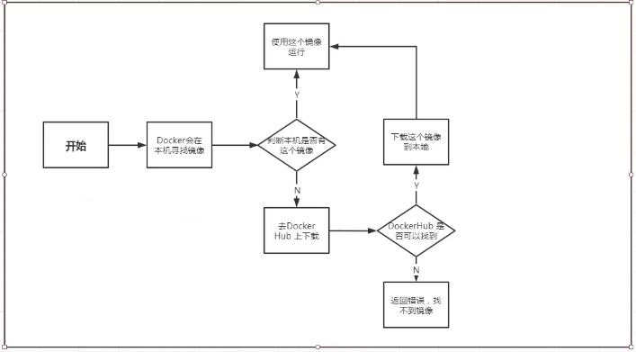
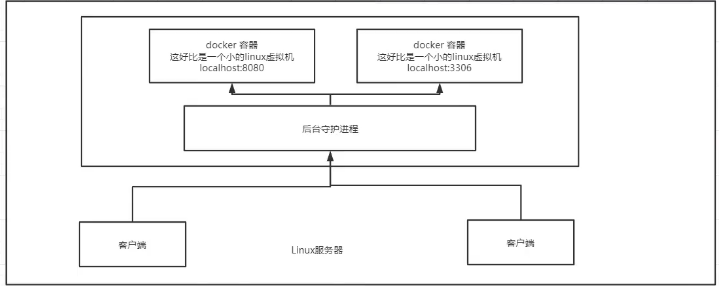

Docker安装

## Docker的基本组成


1. 镜像（image）：docker镜像就好比一个模板，可以通过这个模板来创建容器服务，tomct镜像-->run-->tomcat01容器（提供服务）,通过这个镜像可以创建多个容器（最终服务运行或者项目就是在这个容器中的）
2. 容器（container）：Docker利用容器技术，独立运行一个或者一个组应用，通过镜像来创建的。可以理解为一个简单的linux系统
3. 仓库（repository）：存放镜像的地方，共有仓库，私有仓库。Docker Hub（默认是国外的）阿里云...容器服务器（配置镜像加速）

## 安装Docker

[Docker官方说明文档](https://docs.docker.com/get-docker/) 

## 镜像加速

在/etc/docker/daemon.json中加入镜像源

```shell
{
	"registry-mirrors":["https://docker.mirrors.ustc.edu.cn"]
}
```

## Hello World流程
 

## 底层原理

Docker是怎么工作的?

Docker是一个ClientServer结构的系统，Docker的守护进程运行在主机上。通过Socket从客户端访问
DockerServer接收到Docker-Client的指令，就会执行这个命令。

 

## Docker为什么比VM快

1. Docker有着比虚拟机更少的抽象层
2. Docker利用的是宿主机器的内核，VM需要的是Guest OS。

 

所以说，新建一个容器的时候，docker不需要像虚拟机一样重新价值一个操作系统，避免引导。虚拟机是加载Guest OS，分钟级的
Docker是秒级的。
