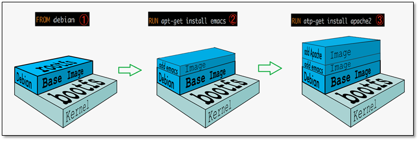

# Docker镜像

## 镜像是什么

**镜像是一种轻量级，可执行的独立软件包，用来打包软件运行环境和基于运行
环境开发的软件，它包含运行某个软件所需的所有内容，包括代码、运行时的库、
环境变量和配置文件。所有的应用，直接打包，就可以直接运行**

1. Docker镜像获得方法

* 从仓库下载
* 别人拷贝
* 自己制作

## Docker镜像原理

> UnionFS(联合文件系统)
UnionFS:Union文件系统是一种分层，轻量并且高性能的文件系统，它支持对文件系统
的修改最为一次提交来一层一层的叠加，同时可以将不同的目录挂载到同一个虚拟文件
下（unite several diretories into a single virtual filesystem),Union文件系统是
Docker镜像的基础，镜像可以通过分层来进行继承，基于基础镜像（没有父镜像），
可以制作各种具体的应用镜像

特性：一次同时加载多个文件系统，但从外面看起来，只能看到一个文件系统
，联合加载会把各层文件系统堆叠起来，这样最终的文件系统会包含所有的底层
文件和目录。

> Docker镜像加载原理
Docker的镜像实际上是一层一层的文件系统组成，这种层级的文件系统UnionFS。
bootfs(boot file system)主要包含bootloader和kernel, bootloader主要是加载
kernel，Linux刚启动时会加载bootfs文件系统，在Docker镜像的最底层是bootfs。这一层
与我们典型的Linux/Unix系统是一样的，包含boot加载器和内核。当boot加载完成
之后整个内核就都在内存中来，此时内存的使用权由bootfs转交给内核，此时系统
也会卸载bootfs。

rootfs(root file system),在bootfs之上。包含的就是典型Linux系统中的/dev，
/proc，/bin，/etc等标准目录和文件。rootfs就是各种不同的操作系统发行版，比如
Ubuntu，Centos等等。

 

可以看到，新镜像是从 base 镜像一层一层叠加生成的。每安装一个软件，就在现有镜像的基础上增加一层。

问什么 Docker 镜像要采用这种分层结构呢？

最大的一个好处就是 - 共享资源。

比如：有多个镜像都从相同的 base 镜像构建而来，那么 Docker Host 只需在磁盘上保存一份 base 镜像；同时内存中也只需加载一份 base 镜像，就可以为所有容器服务了。而且镜像的每一层都可以被共享，我们将在后面更深入地讨论这个特性。

这时可能就有人会问了：如果多个容器共享一份基础镜像，当某个容器修改了基础镜像的内容，比如 /etc 下的文件，这时其他容器的 /etc 是否也会被修改？

答案是不会！
修改会被限制在单个容器内。
这就是我们接下来要说的容器 Copy-on-Write 特性。

新数据会直接存放在最上面的容器层。
修改现有数据会先从镜像层将数据复制到容器层，修改后的数据直接保存在容器层中，镜像层保持不变。
如果多个层中有命名相同的文件，用户只能看到最上面那层中的文件。

 

上图 Debian 和 BusyBox（一种嵌入式 Linux）上层提供各自的 rootfs，底层共用 Docker Host 的 kernel。
这里需要说明的是：
base 镜像只是在用户空间与发行版一致，kernel 版本与发型版是不同的。
CentOS 7 使用 3.x.x 的 kernel，如果 Docker Host 是 Ubuntu 16.04，那么在 CentOS 容器中使用的实际是是 Host 4.x.x 的 kernel。

```shell
[root@iZm5e8ucr8vsejbzgby5olZ ~]# docker run -it centos
[root@e1678f5b909b /]# uname -r
3.10.0-957.21.3.el7.x86_64
[root@e1678f5b909b /]# exit
exit
[root@iZm5e8ucr8vsejbzgby5olZ ~]# docker run -it ubuntu
root@a130ebe32f15:/# uname -r
3.10.0-957.21.3.el7.x86_64
root@a130ebe32f15:/#
```

容器只能使用 Host 的 kernel，并且不能修改。
所有容器都共用 host 的 kernel，在容器中没办法对 kernel 升级。如果容器对 kernel 版本有要求（比如应用只能在某个 kernel 版本下运行），则不建议用容器，这种场景虚拟机可能更合适。

> 平时的CentOS都是G级的，为什么Docker这里才200M

对于一个精简的OS，rootfs可以很小，只需要包含最基本的命令，工具和程序库
就可以了，因为底层直接用了Host的kernel，自己只需要一个rootfs就可以了
。由此可见对于不同的Linux发行版，bootfs基本一致，rootfs会有差别，因此不同
的发行版可以公用一个bootfs。

> 分层原理

容器是运行在最上层的，下面的都是镜像，当容器启动时，一个新的可写层被加载到镜像的顶部。这一层通常被称作“容器层”，“容器层”之下的都叫“镜像层”。

典型的Linux在启动后，首先将 rootfs 置为 readonly, 进行一系列检查, 然后将其切换为 “readwrite” 供用户使用。在docker中，起初也是将 rootfs 以readonly方式加载并检查，然而接下来利用 union mount 的将一个 readwrite 文件系统挂载在 readonly 的rootfs之上，并且允许再次将下层的 file system设定为readonly 并且向上叠加, 这样一组readonly和一个writeable的结构构成一个container的运行目录, 每一个被称作一个Layer。如下图所示。

 

所有对容器的改动，无论添加、删除、还是修改文件都只会发生在容器层中。只有容器层是可写的，容器层下面的所有镜像层都是只读的。

下面我们深入讨论容器层的细节。

镜像层数量可能会很多，所有镜像层会联合在一起组成一个统一的文件系统。如果不同层中有一个相同路径的文件，比如 /a，上层的 /a 会覆盖下层的 /a，也就是说用户只能访问到上层中的文件 /a。在容器层中，用户看到的是一个叠加之后的文件系统。

1. 添加文件：在容器中创建文件时，新文件被添加到容器层中。
2. 读取文件：在容器中读取某个文件时，Docker 会从上往下依次在各镜像层中查找此文件。一旦找到，立即将其复制到容器层，然后打开并读入内存。
3. 修改文件：在容器中修改已存在的文件时，Docker 会从上往下依次在各镜像层中查找此文件。一旦找到，立即将其复制到容器层，然后修改之。
4. 删除文件：在容器中删除文件时，Docker 也是从上往下依次在镜像层中查找此文件。找到后，会在容器层中记录下此删除操作。

只有当需要修改时才复制一份数据，这种特性被称作 Copy-on-Write。可见，容器层保存的是镜像变化的部分，不会对镜像本身进行任何修改。
这样就解释了我们前面提出的问题：容器层记录对镜像的修改，所有镜像层都是只读的，不会被容器修改，所以镜像可以被多个容器共享。

## commit镜像

```shell
docker commit -m="提交信息" -a="作者" 容器ID 镜像名:[TAG]
```
