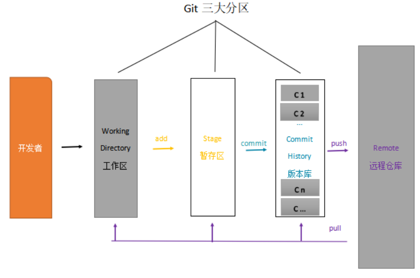
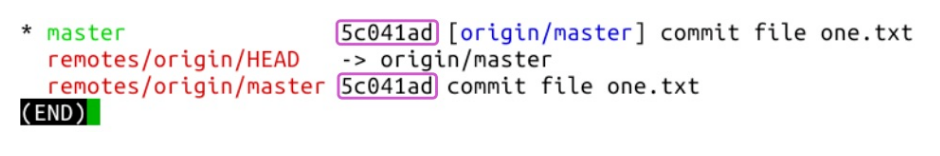
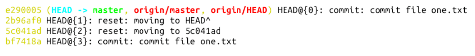

# Git基本操作

## 一、Git仓库的三大区域
 

所有Git命令都以git开头

## 二、一次完整的修改、提交、推送操作
```shell
git status		# 查看整个仓库状态
git add filename 	# 添加修改到暂存区
git reset --filename	# 撤销暂存区的修改
git reset --		# 撤销暂存区的全部修改
git diff 		# 进入工作区修改详情页，按Q退出
git diff --cached	# 进入暂存区的修改详情页
git commit -m "备注"	# 将文件提交到版本区
git log			# 查看版本区的提交记录，每个版本都有自己独特的十六进制序列号
git log --reverse	# 第一次提交在最上面的排序
git config --global user.email "name@email.com"		# 写入你注册GitHub帐号的邮箱
git config --global user.name "name"	# 写入你GitHub的帐号名
git config -l 		# 查看你的信息配置，~/.gitconfig家目录的Git配置文件
git push		# 提交
```

### 分支查询
```shell
git branch -avv		# 查看全部分支信息
```



第一行，开头的星号表示当前所在分支，绿色的 master 是分支名，之所以是绿色，也是因为它是当前所在分支。后面第二项是版本号，第三项中括号里面蓝色的字，表示此分支跟踪的远程分支的名字，当然啦，这也是克隆远程仓库到本地时的默认设置 -- 创建 master 分支并自动跟踪远程同名分支；冒号后面黑色文字表示本地分支领先其跟踪的远程分支一个提交。最后一项是提交时填写的备注信息。

第二行，是 Git 指针信息，它指向远程仓库的 master 分支，这行信息暂不重要。

第三行，远程分支信息，详见第一行的解释。

## 三、版本回退
```shell
git reset --soft HEAD^^	# 撤销前两次提交，返回两次提交提交前的版本--soft软退回,修改之后再提交
git push -f		# 强制提交，处理分支在提交版本上有了冲突，一个文件回退，一个文件提交。就会在提交版本上有冲突。
```

## 四、回退到固定版本
```shell
git reflog	# 查询本地仓库的所有版本变化
```
 

```shell
git reset --hard HEAD@{2}	# 返回固定版本
```
