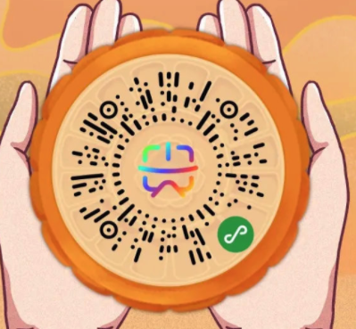

# 云景文旅科技有限公司

## 成立时间：2019.2.27

## 注册资本：2500万

## 什么是文旅：

文化旅游是与旅行者对一个国家或地区文化的参与有关的旅游子集，特别是那些地理区域内人们的生活方式，他们的历史，他们的艺术，建筑，宗教和其他因素帮助塑造了他们的生活方式。

### 概括：

文化旅游包括城市地区的旅游，特别是历史名城或大城市的旅游及其博物馆，剧院等文化设施。

人们普遍认为，文化游客的消费比标准游客多得多。[这种需求]这种旅游形式在世界各地也越来越普遍，经合组织最近的一份报告强调了文化旅游在世界不同地区的区域发展中可以发挥的作用。[3]

文化旅游被定义为“人们从其正常居住地转移到文化景点，目的是收集新的信息和经验以满足他们的文化需求”。[4]这些文化需求可以包括通过观察异国情调的“他人”来巩固自己的文化身份。

### 目的地

一种文化旅游目的地是生活文化区。参观自己以外的任何文化，例如去国外旅行。其他目的地包括历史遗迹，现代城区，“种族口袋”镇，展销会/节日，主题公园，以及自然生态系统。事实表明，文化景点和活动对旅游业尤其有吸引力。[5]文化旅游一词用于包括文化资源访问在内的旅程，无论它是有形的还是无形的文化资源，也不考虑其主要动机。为了适当地理解文化旅游的概念，有必要了解许多术语的定义，例如文化，旅游，文化经济，文化和旅游潜力，文化和旅游者等。[6]

### 发展政策的核心

重要的是目的地规划师必须考虑文化的不同定义，因为该术语是主观的。[来源请求]游客满意度利益，如景观，海景，艺术，自然，传统，生活方式和与之关联的其他产品哪位可以被归类在这个词的最广泛意义上的文化，是一个首要的考虑因素，因为它标志文化目的地发展的初始阶段。

服务和目的地的质量不仅取决于文化遗产，而且更重要地取决于文化环境，可以通过制定控制社区及其利益相关者的控制和政策来进一步发展。[需要引证]因此，可以肯定地说，计划者应该以文化本身的不同含义来应对，因为这推动了发展政策的制定，而这些政策必须进行有效的计划和监测增长（例如，关于保护和保存的严格政策社区）。

## 近期发布产品：“一码游平台”、“5G+AR内容云”、“景区5G自动驾驶服务平台”、“5G文旅互动直播”

### 一码游平台

全称是“一码游全域智慧旅游平台”，该平台以小程序为载体，实现区域旅游资源的迅速整合和多样化一站式游客服务。“一码游平台”为广大游客提供“吃、住、行、游、购、娱”等方面的智慧旅游服务，并打造一个“数据汇聚、产业带动，管理高效、营销精准、服务贴心”的全域智慧旅游全产业共建共赢的旅游生态模式。“一码游平台”是中国联通帮助各级政府开展全域旅游建设的重要产品，目前已经在贵州省成功上线运营，并向全国推广。截止到2020年9月，“一码游贵州”已拥有超过6000万访问量、600万注册量、490家入驻景区、2000家旅游商户、1.8万家酒店，在售商品数量超过6000种。

#### 程序使用体验

“游客只需扫描一个二维码，即可将旅游资讯、个性化产品服务、前沿化科技掌握手中，轻松愉悦地享受到‘扫码即达’的贵州之旅。”该公司市场营销部总经理罗迅介绍，游客扫描的二维码，正是云景文旅公司打造的“一码游贵州”全域智慧旅游平台。
该程序除了热门景区推荐、酒店预订、交通指南、旅游咨询等功能，其贴心服务还体现在每一个细节中，周边卫生间、加油站、充电桩、道路救援等都可实现一键搜索、找寻。除此之外，该平台的定位功能可以自动识别游客扫码时所处的地理位置，随后便会为游客精准推送当地旅游的相关信息和服务，真正实现“方圆之间、触手可及”。从5月19日该平台正式上线，一周的访问数就超过40万人次。
“‘一码游贵州’和传统的‘一机游’最大的区别在于平台的结构。”罗迅说，传统的平台都是由一家企业来负责整体的建设和运营，现在做的“一码游”，是让商家入驻来参与运营，给予最大的定价权，但同时也要监督其售后服务，确保消费者拥有更好的体验。

### 5G+AR内容云

“5G+AR内容云”产品是以5G网络为基础，以增强现实的形式，以云平台为载体，结合文化旅游数字内容，实现文化旅游领域各类现实场景和虚拟数字内容连接、交互的应用。该产品面向景区、古城古镇、博物馆、纪念馆、主题公园、动物园等目的地，赋能导航导览、景点语音讲解、历史文化再现、商业营销互动、IP形象和文创内容植入等增强现实应用场景。目前该产品已在山东泰山、贵州青岩古镇等景区试点成功，并面向全国推广。

### 景区5G自动驾驶服务平台

景区5G自动驾驶服务平台，是由云景文旅联合智网科技共同打造的产品。智网科技是中国联通专注于车联网和自动驾驶领域的专业子公司，参与了多项5G自动驾驶国家标准的制定和国家课题研究。中国联通将5G智慧交通能力服务于旅游景区，助力文旅产业加速进入5G时代。景区5G自动驾驶服务平台是面向景区内部交通的服务平台产品，支持5G自动驾驶的多个场景应用和定制化运营需求，涵盖5G自动驾驶监控、无人车调度管理、无人车远程接管、客户运营服务中心、实景VR体验管理等功能。目前景区5G自动驾驶已经在5A景区海南呀诺达雨林文化旅游区试点成功并投入运营。该平台与联通“景区一体化管控平台”“一码游平台”等产品融合，让5G时代景区内实现摆渡车、清扫车等车辆的自动驾驶运营成为现实，提升游客体验，增加服务亮点，降低景区运营成本。

### 5G文旅互动直播产品

5G文旅互动直播产品源于2020年初新冠疫情期间，云景文旅根据中国联通集团要求，紧急面向全国文旅行业发起的5G文旅互动直播公益行动。疫情期间，累计为80多个景区及文博场馆提供了100多场免费的5G文旅互动直播，观看人次超过2000万。公益行动丰富了宅家百姓的精神文化生活，助力旅游目的地线上营销，获得行业认可。目前，5G文旅互动直播服务成功实现产品化，依托5G网络，利用自有云导播能力，实现4K/8K高清、VR全景直播等形式，针对文旅行业客户宣传推广、文化传播、产品营销、科普教育、活动预热等各类需求提供5G直播技术服务。

## 公司前景

云景文旅的前身是中国联通贵州旅游信息化产品基地。2019年3月，搭乘联通混改的“东风”，中国联通以贵州旅游基地为基础，与腾讯公司共同出资成立云景文旅科技有限公司，落地贵阳。这家融合资本与技术两大优势的企业，从成立的一刻起，就立志要在中国的文旅信息化领域创出一片天地。

作为中国联通的合资子公司之一，云景文旅与联通的其他“云字辈”合资公司一样，都是中国联通优势资源整合下的产物。“业务先行、市场化导向机制”，中国联通与腾讯“两座大厦”得以在云景的土地上同时落成。

云景文旅继承了中国联通已有的数据能力和智慧文旅产品体系，结合了中国联通遍布全国31省的本地化服务优势；同时，基于联通的5G技术优势，云景文旅也在不断强化自身5G+文旅体验产品的研发能力，形成5G核心竞争力。此外，在联通集团的统筹部署和指导下，云景文旅与联通大数据公司、系统集成公司、云公司、安全公司、云粒智慧、智网科技等联通旗下各专业子公司能力协同，将持续为文旅产业带来全面、专业的产品和服务。

腾讯的基因为云景文旅探索智慧文旅的道路提供了新的助力。腾讯10亿用户的融媒体平台、以微信为核心的产品生态圈以及“文化+旅游”的文创能力，都极大地提升了云景文旅在文旅信息化市场上的竞争力。

企业需要从“抢占市场”转变为“创造市场”，从前期以市场占有率为导向，到现在以技术创新为卖点。这是中国联通文旅行业团队多年探索实践的重要经验，而云景文旅正肩负着5G智慧文旅自主创新的重任，一路探索前行。勇于创新，苦炼内功，这家朝气蓬勃的企业未来将吸引更多的文旅行业客户向其敞开怀抱。
